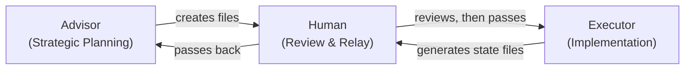

# AI Lock File Workflow

A system for natural language programming that makes probabilistic AI output deterministic.

Separates strategic planning from tactical execution using structured files as the communication layer between two AI agents. With proper constraints tracked across both agents, AI becomes reliable.

---

## The Problem It Solves

AI coding agents are capable but prone to drift. Left unconstrained, they improvise; changing things they shouldn't, forgetting decisions made three sessions ago, and breaking working code while fixing something else.

When you can't directly verify every output because you're working outside your technical expertise, or the code base is just too big that drift is invisible until something breaks.

The Lock File Workflow solves this by making constraints explicit before implementation begins. The AI that plans never touches code. The AI that writes code never makes design decisions. A human passes files between them. Nothing drifts because nothing is left to interpretation and each AI remains in it's own silo.

The advisor is meant to map out a plan, help guide architecture decisions and create the fences for which the outcome needs to be shaped as. 

The executor is meant to solve problems within its constraints. That's exactly what you want; AI making implementation decisions freely, as long as it can't move the fences.

---

## The Three Actors

| Actor | Role | Never Does |
|-------|------|------------|
| **Advisor** | Makes decisions, creates constraints, writes specs | Touches code |
| **Human** | Reviews output, passes files, approves changes | Skips review |
| **Executor** | Reads files, writes code, reports state | Makes design decisions |

The Advisor and Executor never communicate directly. All information passes through files the human manually moves between them. That handoff is the mechanism that prevents drift.

---

## The File System

Five file types. Each with one job.

| File | Created By | Read By | Purpose |
|------|-----------|---------|---------|
| `00-START-HERE.md` | Advisor | Executor | Project context, tool setup, reading order |
| `LOCK-[domain].md` | Advisor | Executor | Immutable constraints (design, content, architecture) |
| `SPEC-[phase].md` | Advisor | Executor | Exact implementation instructions for one phase |
| `INVENTORY-[date].md` | Executor | Advisor | Current state snapshot of what was actually built |
| `CHANGELOG-[date].md` | Executor | Advisor, Human | Forensic record of every change, keyed to line numbers |

Lock files are essentially high-level programming; they define what cannot change. They get updated before a spec is written, never during active implementation.

---

## Navigate This Repository

- **[SKILL.md](SKILL.md)** — The complete Claude skill file. Drop this into any Claude project to activate the workflow. Start here if you want to use the system.
- **[QUICK-START.md](QUICK-START.md)** — Day-one setup. Five steps to your first working iteration.
- **[WORKFLOW.md](WORKFLOW.md)** — Full technical narrative. How this system was developed, why each decision was made, and how the workflow became reliable.

---

## When to Use This

This pattern works for any domain where you need to direct an AI to build:

- Web development (the origin case: JavaScript without knowing JavaScript)
- Data engineering (schema design, transformation logic)
- Mobile development (navigation flows, state management)
- Embedded systems (hardware specs, protocols)
- Business automation (workflow rules, integrations)

The pattern: define what cannot change (locks), specify what should change (specs), let the executor implement within bounds.

---

## Origin

Built during a client website migration; React/Vite to Astro, no JavaScript knowledge, fixed timeline, no budget for a specialist.

The problem wasn't capability. It was guardrails. When the executor can change anything, it will change things it shouldn't. The Lock File Workflow came out of that directly: build the fence first, then hand the tools to the executor.

---

## License

MIT — Use freely, personally or commercially.

---

*Developed at Automation Architect.*
