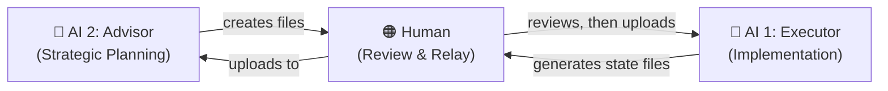
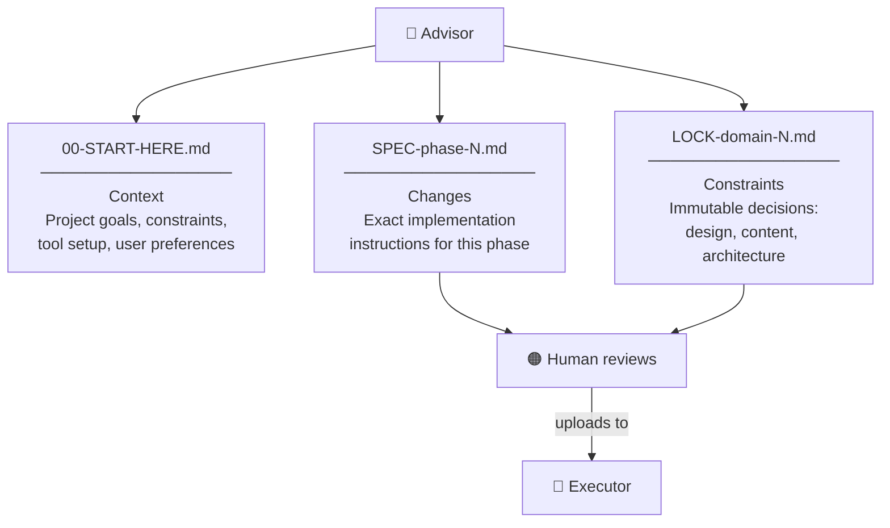
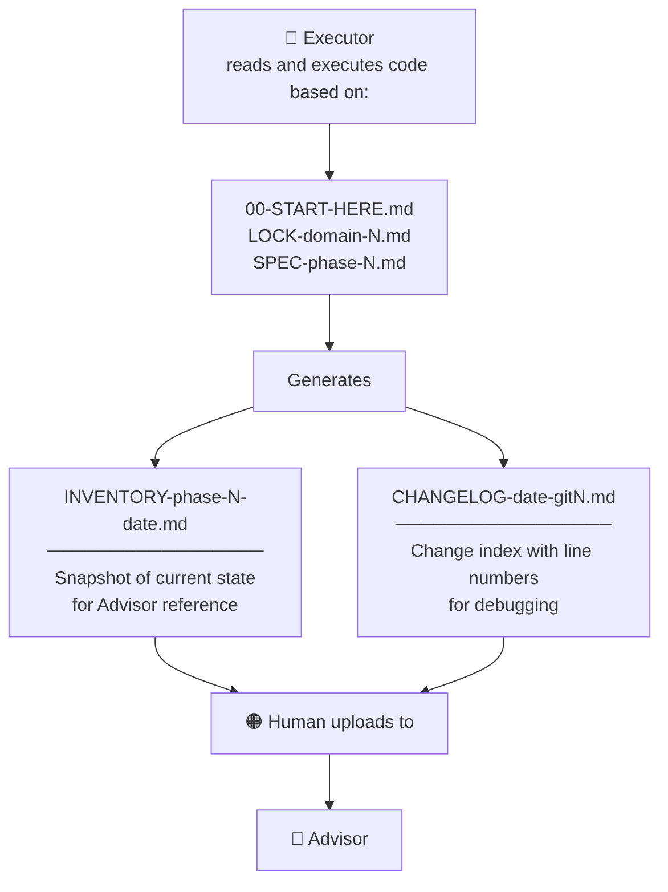
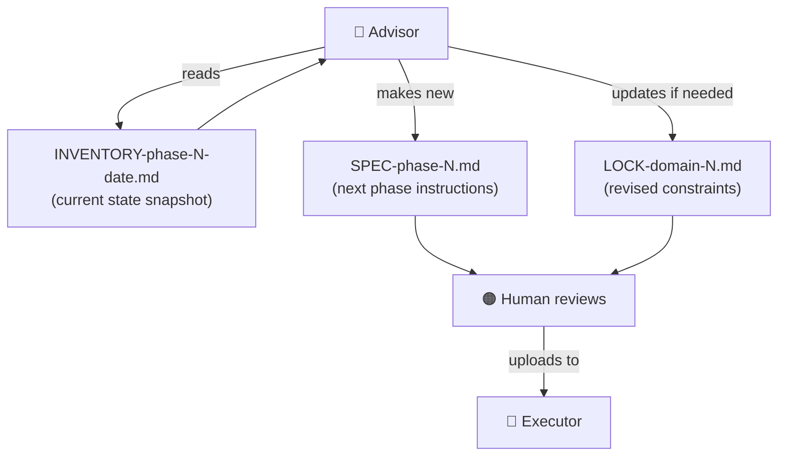
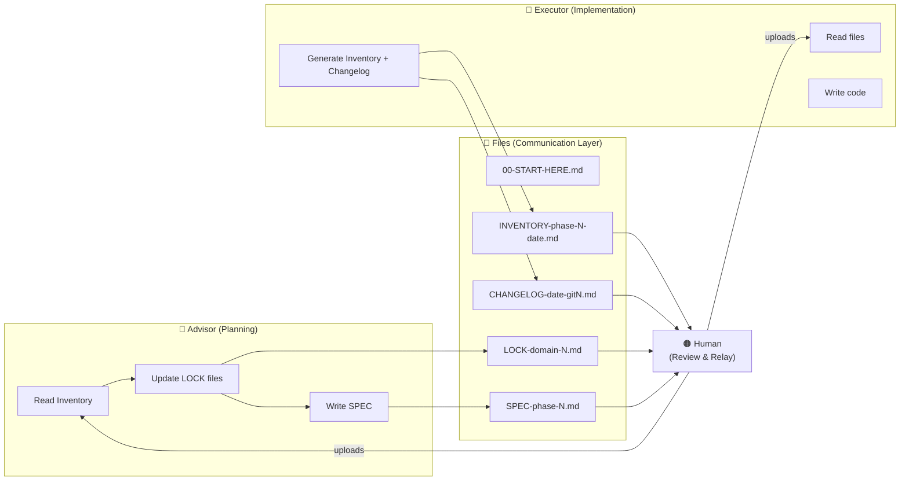

# AI Lock File Workflow

A system for reliable AI-assisted development. Separates strategic planning from tactical execution using structured files as the communication layer between two AI agents and a human in the middle.

Developed over 50+ implementation sessions, achieving 99% accuracy with zero breaking changes on a React → Astro migration — without prior JavaScript knowledge.

---

## The Core Problem This Solves

AI coding agents are capable but prone to drift. Left unconstrained, they improvise — changing things they shouldn't, forgetting decisions made three sessions ago, and breaking working code while fixing something else.

The Lock File Workflow solves this by making constraints explicit and immutable. The AI that plans never touches code. The AI that writes code never makes design decisions. A human passes files between them. Nothing drifts because nothing is left to interpretation.

---

## Separation of Concerns

The system has three actors with strictly defined roles.

| Actor | Role | Never Does |
|-------|------|------------|
| **Advisor** | Makes decisions, creates constraints, writes specs | Touches code |
| **Human** | Reviews output, passes files, approves changes | Skips review |
| **Executor** | Reads files, writes code, reports state | Makes architectual decisions |

The Advisor and Executor never communicate directly. All information passes through files the human manually moves between them. This is the mechanism that prevents drift.

---

## Phase 1: The Advisor Generates Files

At the start of a project or phase, the Advisor produces three categories of files.

**File purposes:**

`00-START-HERE.md` — The project context file. The Executor reads this first on every session. Contains tool setup, file hierarchy, critical rules, and reading order. Written once, rarely changed.

`LOCK-[domain].md` — Immutable constraint files. One per domain (design, content, architecture, etc.). These represent current desired state. The Executor reads them as ground truth and cannot deviate from them. Examples: `LOCK-design.md`, `LOCK-content.md`, `LOCK-architecture.md`.

`SPEC-[phase-N].md` — Implementation instructions for a single phase. References the lock files explicitly. Tells the Executor exactly what to change, in what order, with acceptance criteria. Created fresh each phase.

**Critical rule:** Lock files are updated *before* a spec is created — never during active implementation.

---

## Phase 2: The Executor Implements and Reports

The Executor reads the files, writes the code, and generates two output files as proof of work.

`INVENTORY-[phase#]-[date].md` — A structured snapshot of what currently exists in the codebase. Not a changelog — a present-tense description of state. The Advisor reads this to understand what was actually built before planning the next phase.

`CHANGELOG-[date]-[git#].md` — A forensic record of every change made, keyed to line numbers and git commit hash. Used for debugging when something breaks, and as a paper trail for cross-session continuity.

The human commits the code to git, then passes the commit hash to the Executor so the changelog can be anchored to a specific state.

---

## Phase 3: The Advisor Closes the Loop

With the Inventory in hand, the Advisor reads current state, generates the next spec, and updates lock files if decisions have changed.

This is the feedback loop. The Advisor never assumes what the Executor built — it reads the Inventory to verify actual state, then plans the next phase from ground truth. If something unexpected happened, it surfaces here before the next spec is written.

---

## Complete System at a Glance

---

## File Reference

| File | Created By | Read By | Purpose |
|------|-----------|---------|---------|
| `00-START-HERE.md` | Advisor | Executor | Project context, tool setup, reading order |
| `LOCK-[domain].md` | Advisor | Executor | Immutable constraints by domain |
| `SPEC-[phase-N].md` | Advisor | Executor | Implementation instructions for one phase |
| `PROMPT-[tool]-header.md` | Advisor | Executor | Behavioral instructions for the executor tool |
| `INVENTORY-[phase#]-[date].md` | Executor | Advisor | Current state snapshot |
| `CHANGELOG-[date]-[git#].md` | Executor | Advisor, Human | Change record keyed to git commit |

---

## Why It Works

**Constraints prevent invention.** Lock files tell the Executor exactly what is decided. There is no room to improvise on design, copy, or architecture decisions.

**Separation prevents contamination.** The Advisor never sees the codebase directly. The Executor never makes decisions. Neither can corrupt the other's domain.

**Inventory prevents assumption.** The Advisor reads actual state before planning next steps. Cross-session drift is caught at the inventory review, not three phases later.

**The human is the integrity layer.** Every file transfer is a review opportunity. Nothing moves forward without deliberate human action.

---

## Origin

This system was developed to solve a specific problem: delivering a JavaScript project without knowing JavaScript. The constraint wasn't a lack of capability — it was a lack of guardrails. When an AI agent can change anything, it will change things it shouldn't.

The Lock File Workflow was the answer: build the fence first, then hand the tools to the executor.

It has since been applied to data pipelines, document processing systems, and static site builds. The file structure adapts to the domain. The separation of concerns does not.

---

## License

MIT
